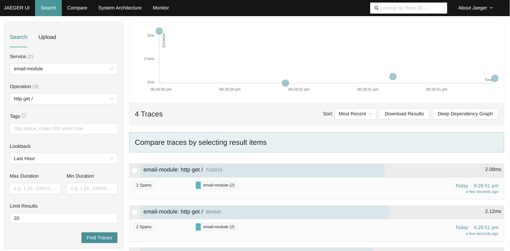
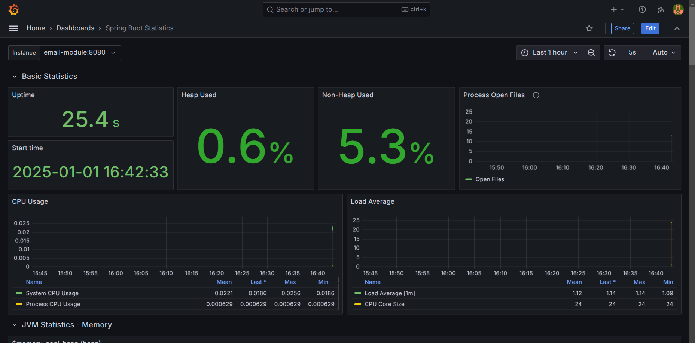

# springboot - microbase

springboot - microbase is an open-source starter project for quickly building `scalable` and `maintainable` Spring Boot-based microservices.

The project provides a solution for `centralized log collection` using Logstash, Elasticsearch, and Kibana, alongside `monitoring capabilities` with Prometheus, Jaeger, and Grafana. It also includes basic JPA functionality to facilitate database interactions.

For designing the `database schema`, we recommend using the following project: [Evocelot/liquibase-base ](https://github.com/Evocelot/liquibase-base).

## Technologies used

- Java 21
- SpringBoot 3.4.2
- Docker / Podman
- Make
- Elasticsearch
- Logstash
- Kibana
- Jaeger
- Prometheus
- Grafana


## How to run:

The project includes a `Makefile` to simplify application startup. Each Makefile target can be executed independently.

> **_NOTE:_** If you are using Docker instead of Podman, replace `podman` with `docker` in the Makefile commands.

### Run with full stack

To run the application along with ELK stack and observability features, execute:

```bash
make all
```

This command starts the following containers:

- elasticsearch
- logstash
- kibana
- jaeger
- prometheus
- grafana
- sample-module

By default, the sample-module runs on port `8080`.
The swagger UI can be accessed at: http://localhost:8080/swagger-ui/index.html

### Run the module only

To run only the module only:

```bash
make start-local-container
```

> **_NOTE:_** To disable log collection and tracing, manually set the `LOGSTASH_ENABLED` and `TRACING_ENABLED` environment variables to `"false"` in the `Makefile`.

## Logging

The project utilizes the `ELK stack` for `centralized log collection` and monitoring:

- Logstash: Extracts logs from the application and forwards them to Elasticsearch.
- Elasticsearch: Stores, indexes, and makes the application's logs searchable.
- Kibana: Provides a user interface for managing the logs stored in Elasticsearch.

> **_NOTE:_** To enable log forwarding to Logstash, set the `LOGSTASH_ENABLED` environment variable to `"true"` in the container’s startup configuration.

View logs in Kibana:


## Monitoring

The project integrates the following tools for monitoring and observability:

- Jaeger: Collects and displays tracing information.
- Prometheus: Collects and stores application metrics.
- Grafana: Visualizes metrics in an intuitive interface.

> **_NOTE:_** To enable tracing collection, set the `TRACING_ENABLED` environment variable to `"true"` in the container’s startup configuration.

View tracing informations in Jaeger:


App monitoring in Grafana:


## Documentation

Detailed documentation is available here: [Documentation](/docs/docs.md)

## Contributions

Contributions to the project are welcome! If you find issues or have suggestions for improvements, feel free to open an issue or submit a pull request.
