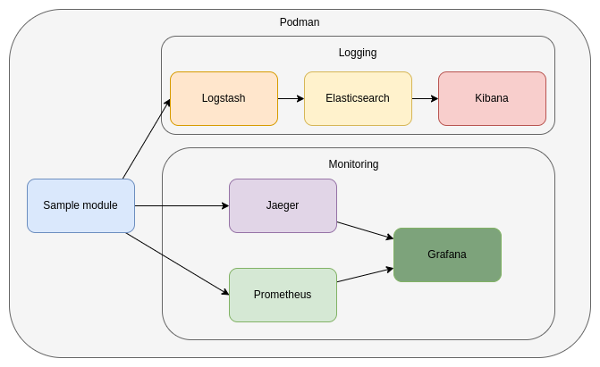
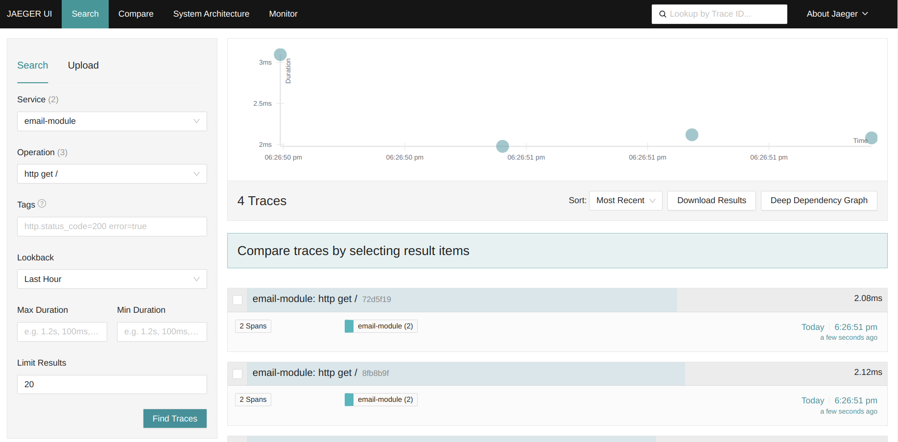

# springboot-microbase documentation

## Application Architecture  
The architectural design of the application is detailed in the diagram provided.

  

## Environment variables

The following environment variables can be configured when running the application:

Environment variable | Sample value | Description |
--- | --- | --- |
SPRING_PROFILES_ACTIVE | dev | The profile to run with the application. |
LOGSTASH_ENABLED | "true" | Enable or disable log forwarding to Logstash (`"true"` or `"false"`). |
LOGSTASH_HOST | logstash | The name of the logstash container to push the logs from the springboot app. It is only required when the `LOGSTASH_ENABLED` environemnt variable is `"true"`. |
LOGSTASH_PORT | 5000 | The port of the logstash container. It is only required when the `LOGSTASH_ENABLED` environemnt variable is `"true"`. |
TRACING_ENABLED | "true" | Enable or disable tracing (`"true"` or `"false"`). |
TRACING_URL | http://jaeger:4318/v1/traces | The url of the jaeger instance for sending tracing details. It is only required when the `TRACING_ENABLED` environemnt variable is `"true"`. |
KAFKA_ENABLED | "true" | If set to `"true"` messages about file operations (such as successful uploads) will be sent to the appropriate Kafka topic. |
KAFKA_URL | evocelot-kafka:9092 | The url of the kafka instance.
KAFKA_GROUP_ID | file-group | The id of the kafka group.
SPRING_DATASOURCE_URL | jdbc:mariadb://evocelot-mariadb:3306/sample | The JDBC URL of the DBMS to connect to. |
SPRING_DATASOURCE_USERNAME | root | The username for connecting to the DBMS. |
SPRING_DATASOURCE_PASSWORD | admin | The password for connecting to the DBMS. |
SPRING_DATASOURCE_DRIVER_CLASS_NAME | org.mariadb.jdbc.Driver | The fully qualified name of the JDBC driver class used for the DBMS connection. |

## Kafka topic configuration

If the `KAFKA_ENABLED` environment variable is set to `"true"`, the following event will be triggered.

### file-saved

Upon a successful sample entity save, the metadata of the saved entity will be published to the `sample-saved` topic in JSON format. 

Example message:
```json
{
	...
}
```

## Logging

The project utilizes the `ELK stack` for `centralized log collection` and monitoring:

- Logstash: Extracts logs from the application and forwards them to Elasticsearch.
- Elasticsearch: Stores, indexes, and makes the application's logs searchable.
- Kibana: Provides a user interface for managing the logs stored in Elasticsearch.

> **_NOTE:_** To enable log forwarding to Logstash, set the `LOGSTASH_ENABLED` environment variable to `"true"` in the container’s startup configuration.

View logs in Kibana:


## Monitoring

The project integrates the following tools for monitoring and observability:

- Jaeger: Collects and displays tracing information.
- Prometheus: Collects and stores application metrics.
- Grafana: Visualizes metrics in an intuitive interface.

> **_NOTE:_** To enable tracing collection, set the `TRACING__ENABLED` environment variable to `"true"` in the container’s startup configuration.

View tracing informations in Jaeger:


App monitoring in Grafana:


## local.env

The project includes a file named `local.env`, which stores the application details.

Environment variable | Sample value | Description |
--- | --- | --- |
APPNAME | sample-module | The name of the application |
VERSION | 0.0.1-SNAPSHOT | The version number of the application |

## Building the Docker Image

To build the Docker image for this application, use the following command:

```bash
make build-docker-image
```

This command reads the configuration from the `local.env` file, builds the Docker image with the specified settings, and tags it according to the `APPNAME` and `VERSION` values in the configuration.

## Loggin request and response details.

This Spring Boot application features a custom interceptor that `logs detailed information about incoming requests and outgoing responses in JSON format`. Each request and response log is enriched with a unique trace identifier `REQUEST-ID` that is also included in the response headers.

### REQUEST-ID in Request and Response Headers

Adds or uses a custom header `REQUEST-ID` from the request to ensure traceability between request and response logs. If the `REQUEST-ID` header is not present in the request, a new one is generated and included in the response headers.
